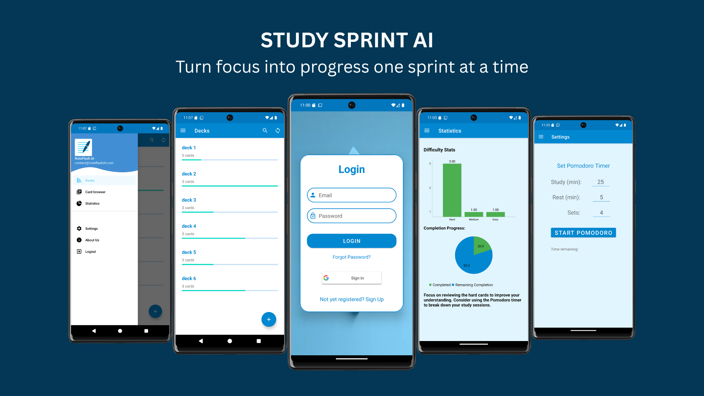

# Study Sprint AI

Study Sprint AI is a smart Android flashcard app designed to help you memorize faster and study smarter. It features AI-optimized algorithms and handy tools to make your learning efficient and effective.

---

## Features

- 🎯 Select difficulty levels: Easy, Medium, Hard  
- 📂 Create custom decks  
- 📸 Scan pictures and convert to decks  
- ⏲️ Pomodoro timer for focused studying  
- 🔐 Login and sign-up system  
- 📊 Analytics to identify decks needing focus  

---

## Getting Started

### Prerequisites

- Android Studio (for building from source)  
- Android device or emulator  

---

## Usage

- Sign up or log in to start tracking your progress.  
- Create custom decks or scan pictures to auto-generate flashcards.  
- Choose your preferred difficulty level (Easy, Medium, Hard) per card.  
- Use the Pomodoro timer to manage focused study sessions.  
- Review analytics to see which decks need more attention.  

---

## Contributing

Contributions are welcome! Please open issues or submit pull requests for bug fixes, features, or improvements.

---

## License

This project is licensed under the MIT License. See the [LICENSE](./LICENSE.txt) file for details.

---

## Contact

For questions or feedback, reach out at [francisco.paulo.pf@example.com].
